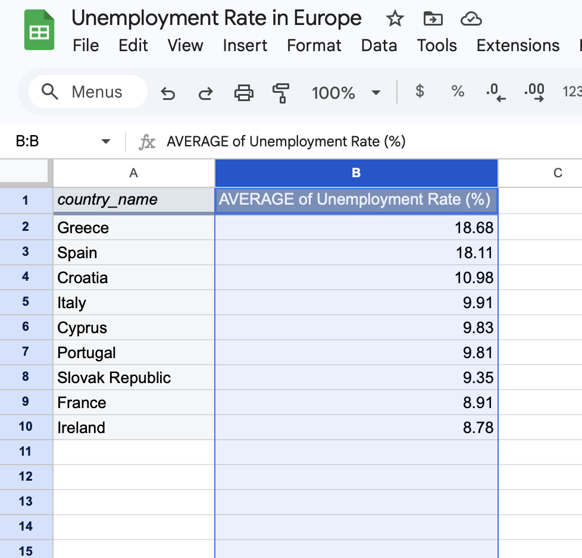
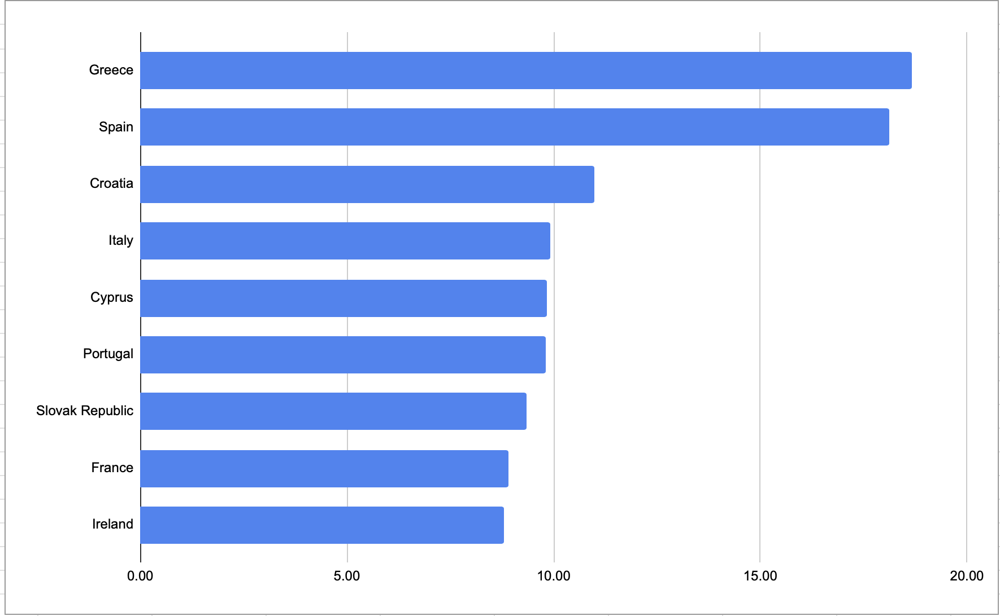

# EU Unemployment Analysis

## Description
This project analyzes unemployment rates across European countries using Google Sheets.

## Tools
- Google Sheets

## What I did
- Cleaned the dataset
- Created a pivot table
- Calculated average unemployment
- Built a bar chart

## Insights
- Greece has the highest unemployment rate
- Spain follows closely
- There is a clear gap between countries

## Files
- unemployment-data.xlsx
- bar-chart.png
- data-table.png
- ## Final Table

## Visualization

## Key Insights

- Greece had the highest unemployment rate in the dataset.
- Spain had the second-highest unemployment rate, very close to Greece.
- Croatia was the third-highest country in the comparison.
- Italy, Cyprus, and Portugal had similar unemployment levels, around 10%.
- France and Ireland had lower unemployment rates compared with the top countries in the chart.
